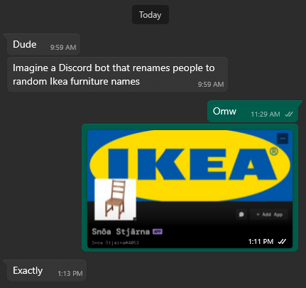

<h1 align="center">✨ Ikea-Furniture-Discord-Bot ✨</h1>

<h6 align="center"><em>Discord bot to rename server members to Ikea furniture</em></h6>

## 📝 Overview

This is a simple discord bot which allows a server administrator to rename
server members to Ikea furniture.

The data found in [ikea-furniture.csv](./data/ikea-furniture.csv) was scraped
from the all-time Ikea furniture catalog, I won't include the scraper code here.

### Why?



## ✨ Features
- Rename all server members to Ikea furniture randomly
- Rename a specific server member to random Ikea furniture
- Detailed client logging

## 🌐 Dependencies

- [Python3.12 or above](https://www.python.org/downloads/)
- [python-dotenv](https://pypi.org/project/python-dotenv/)
- [Nextcord](https://docs.nextcord.dev/en/stable/)
- [Pandas](https://pandas.pydata.org/)
- [NumPy](https://numpy.org/)

**You can manually install these by:**

1. Install [Python3.12](https://www.python.org/downloads/) or above.
2. Ensure pip is installed:

```sh
# Change to just python if on windows
python3 -m ensurepip --upgrade
```

3. Install the external libraries required:

```sh
# Change to just pip if on windows
# Note: must be run in the repository
pip3 install -r requirements.txt
```

4. Note that if you have discord.py installed, you must remove it:

```sh
# Change to just pip if on windows
pip3 uninstall discord.py
```

Note that the script will attempt to install any missing library dependencies,
<br>
however, it's not guaranteed that it will work, I strongly recommend you install these yourself.

#### Why nextcord?

This is my first time using nextcord. The usual library used for discord bots in python is
[discord.py](https://github.com/Rapptz/discord.py).
<br>
I've used this library a lot having made so many bots, and in time I've grown more and more
frustrated at it's usage.
<br>
I find the library doesn't have enough testing nor support given how popular it is.
<br>
Originally, this was also done in discord.py, but changed later due to the extreme
<br>
lack of support for classes (e.g. unable to create a slash command in the bot class or a cog).
<br>
This is just purely for a lack of support and documentation on this as well.
<br>
I'm really pleased with how nextcord improves upon discord.py, so I'll probably be using this from now on.

## 💻 Usage

This is a *self-hosted bot* - meaning you will need to host and maintain your own instance.
<br>
To create your own instance, please see the [discord developer](https://discord.com/developers/) page.
<br>
The bot account assets are saved in the `assets/` directory, use these if you'd like.
<br>
Note that the bot is required to be a public bot in order for it to be used on server.
<br>
Therefore in the installation section, check `Guild Install` and uncheck `User Install`,
then make sure you have the `applications.command` as well as the `bot` scopes enabled.
<br>
Ensure you have the `Change Nickname` and the `Manage Nicknames` permissions set.
<br>
Finally, in the bot section, ensure you have `PUBLIC BOT` toggled on,
and all three privileged gateway intents toggled on.
<br><br>
To host an instance, clone the repository:

```sh
git clone https://github.com/DontCallMeLuca/Ikea-Furniture-Discord-Bot
cd Ikea-Furniture-Discord-Bot
```

Make sure you have all [dependencies](#-dependencies) installed.
<br>
You will need to create your own `.env` file, this will store
all of your runtime data securely.
<br>
The module expects both `BOT_TOKEN` and `BOT_PREFIX` variables to be defined.
<br>
An example `.env` file would look like:

```ini
BOT_TOKEN=MTM0MzU1M #etc.
BOT_PREFIX=.
```

Once this is all done, run the following command:

```sh
# Change to python if on windows
python3 src/main.py
```

Optionally, use the script wrappers:

If using Windows: [run.bat](./run.bat)

```bat
run.bat
```

Otherwise: [run.sh](./run.sh)

```sh
chmod +x ./run.sh
./run.sh
```

<br>

Once on a server, you can use the `/ikea` and the `/ikea_all` commands to rename server members.
<br>
(Note that only server administrators can do this).

## 📊 Logging

Detailed client logs can be found at:

```
logs/client.log
```
###### _Currently, its an example logfile._

Each runtime will override this log, please keep this in mind.

## 📃 License

This project uses the `GNU GENERAL PUBLIC LICENSE v3.0` license
<br>
For more info, please find the `LICENSE` file here: [License](LICENSE)
